# 前言

此项目是本人大一期末写的实验项目，利用Java Swing编写的用于模拟ATM的存取款等功能的一个小项目

# 功能

- 登录
- 查询
- 存款
- 取款
- 改密

## 登录

首先进入欢迎界面

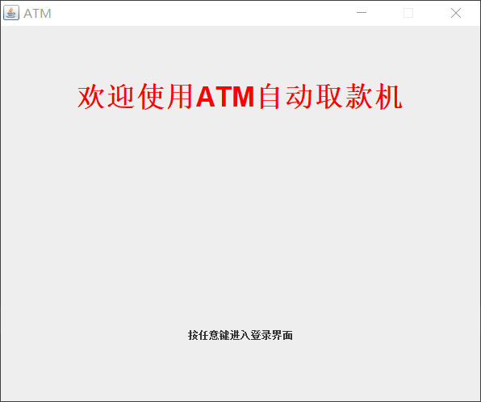

按任意键进入登录界面

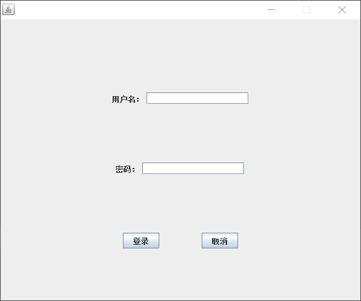

输入用户名，密码，默认123456，进入面板

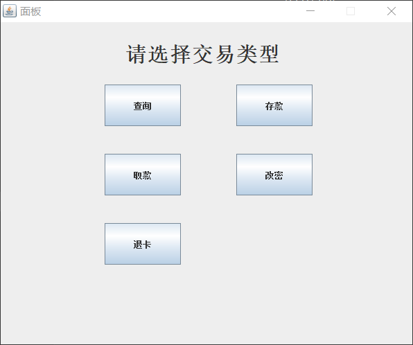

输错，则报错

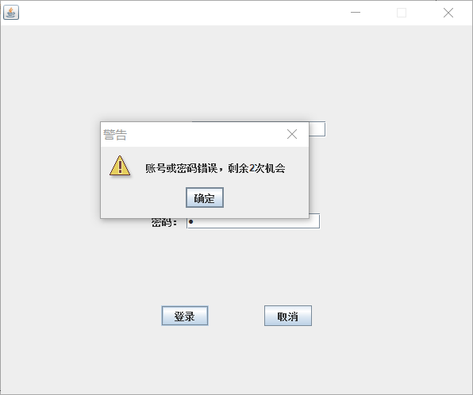

若3次都输错，则强制退出程序

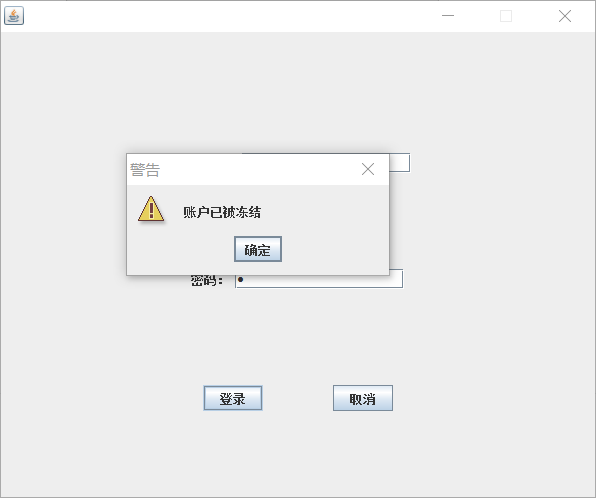

## 查询

选择查询功能后，显示`当前账户余额`和`可用账户余额`

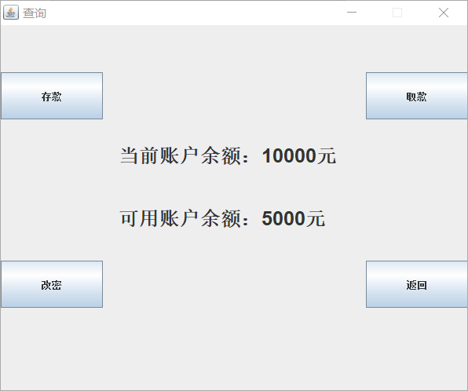

## 存款

可选择以下功能进行存款，这里我存了5500元

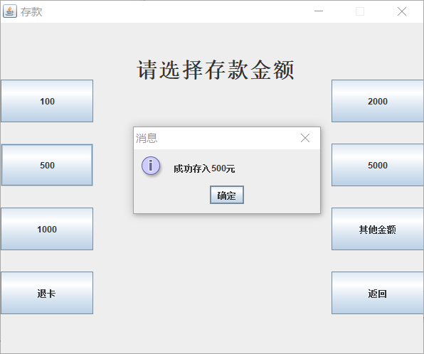

查询一下，成功存入

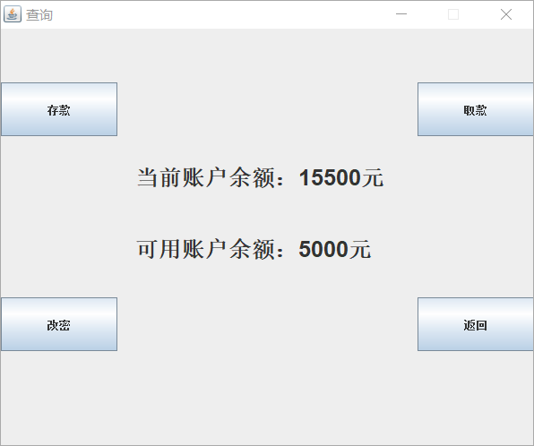

## 取款

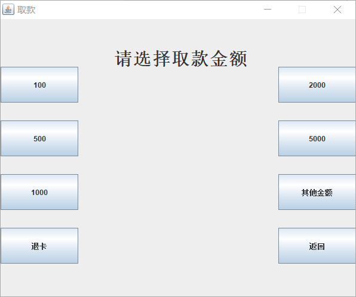

这里我先取5000

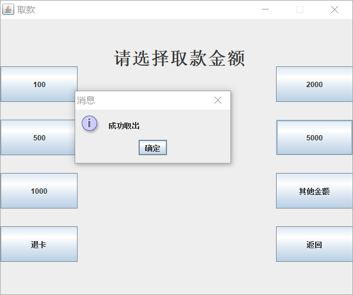

此时可用额度为0，再取100，取不出来了

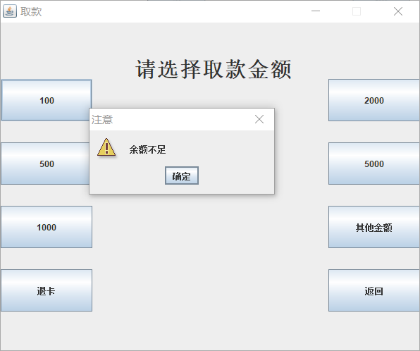

查询一下，可以看到可用账户余额为0

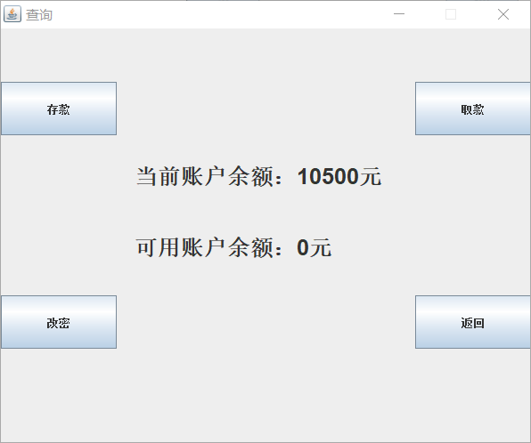

## 改密

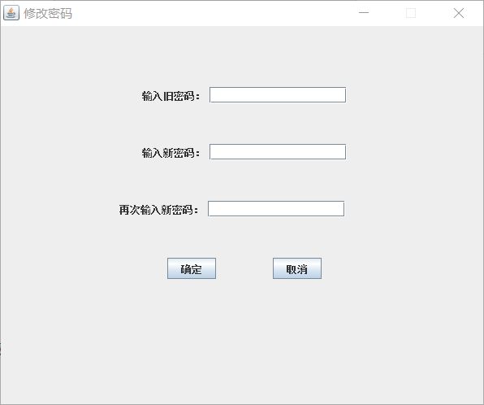

# 总结

由于经验时间有限，只用了java基础部分的知识来完成，所以本项目存在很多缺陷，相信以后会改进的

